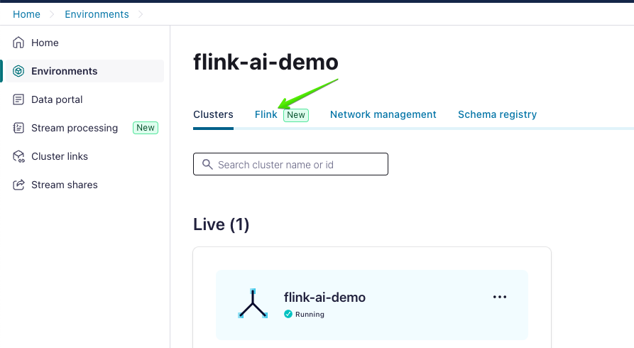
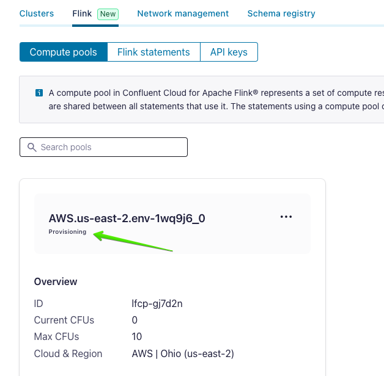
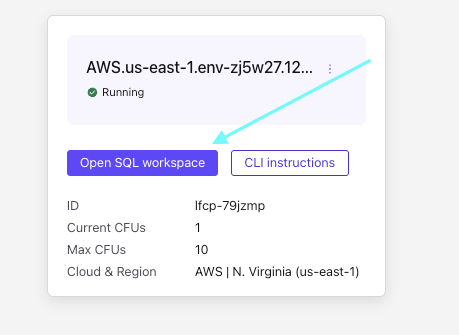
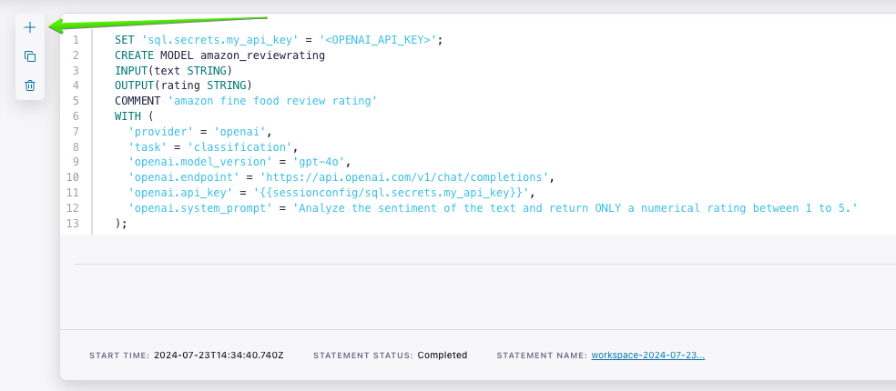

# An Agentic RAG Restaurant Recommendor Chatbot Application built on Confluent Cloud

Raw reviews and user visits are ingested into Confluent Cloud via programmatic client, the reviews are enriched with AI agents built on [model inference in Flink](https://docs.confluent.io/cloud/current/flink/reference/functions/model-inference-functions.html), and, finally, Flink SQL provides the orchestration to deliver recommendations based on reviews, predictions about the reviews, and past visits.
This demo leverages components in Confluent Cloud in order to show how to build an agentic AI system on data. 


## Prerequisites

The following steps and tools are required to run this demo:

* Clone this repo if you haven't already and `cd` into the `agentic-rag` directory:

  ```bash
  git clone https://github.com/confluentinc/demo-scene
  cd agentic-rag
  ```
* An OpenAI account and API key. 
Once you sign up and add money to your account, go to the [Project API keys page](https://platform.openai.com/api-keys) and click `Create new secret key`. 
Copy this key, as we will need it later when creating a remote model in Flink.
* A Confluent Cloud account. 
[Sign up](https://www.confluent.io/confluent-cloud/tryfree) for a free trial if you don't already have one.
* The Confluent CLI. 
Refer to the installation instructions [here](https://docs.confluent.io/confluent-cli/current/install.html).

## Provision Kafka cluster

We'll use the Confluent CLI to create a Kafka cluster. First, login to your account by running the following command in your terminal:

```shell
confluent login --prompt --save
```

Next, install a CLI plugin that will create many of the resources required for this demo:

```shell
confluent plugin install confluent-cloud_kickstart
```

This plugin allows you to provision a Confluent Cloud environment, cluster, and API key in one command. 
It also enables Schema Registry. 
You may pick `aws`, `azure`, or `gcp` as the `--cloud` argument, and any supported region returned by `confluent kafka region list` as the `--region` argument. 
For example, to use AWS region `us-east-2`:

```shell
confluent cloud-kickstart --name agentic-rag \
  --env agentic-rag \
  --cloud aws \
  --region us-east-2 \
  --output-format stdout
```

The output of this command will contain Kafka and Schema Registry API connection properties that we will use in the next section.

## Produce reviews

Now we can produce product reviews into a `restaurant_reviews` topic on Confluent Cloud.

First, create the topic by running the following command in your terminal:

```shell
confluent kafka topic create restaurant_reviews
```
```shell
confluent kafka topic create user_restaurant_visits
```

Second, Create a virtual environment and activater it by running the following command in your terminal:
```shell
python -m venv venv
```
For Mac machines
```shell
source venv/bin/activate
```
For Windows machines
```shell
.\scripts\bin\activate.bat
```

Install the dependencies required by running the following command in your terminal:
```shell
pip install -r requirements.txt
```

Next, inspect the `app/csv/restaurant_reviews.csv` and `app/csv/user_restaurant_visits.csv` files. 
Feel free to add additional rows or edit the reviews. Not, though, that for the RAG aspect of this demo you'll also need to 
create accompanying orders in MongoDB Atlas in a later section.

* Open the files `app/producer/restaurant_reviews_producer.py` and `app/producer/user_visit_producer.csv`, find where the `cc_config` and `sr_config` objects are instantiated.
  * Substitute the `Bootstrap servers endpoint` output earlier for `<BOOTSTRAP SERVERS ENDPOINT>`
  * Substitute the `Kafka API key` output earlier for `<KAFKA API KEY>`
  * Substitute the `Kafka API secret` output earlier for `<KAFKA API SECRET>`
  * Substitute the `Schema Registry Endpoint` output earlier for `<SR ENDPOINT URL>`
  * Substitute the `Schema Registry API key` output earlier for `<SR API KEY>`
  * Substitute the `Schema Registry API secret` output earlier for `<SR API SECRET>`

* Now run the Python programs to produce the reviews in the CSV file to the `restaurant_reviews` and `user_restaurant_visits` topic.
  
  ```shell
    cd app/producer
  ```

  ```shell
    python restaurant_reviews_producer.py
  ```
    You should see output like:
  ```shell
    Producing restaurant review records to topic restaurant_reviews. ^C to exit.
    Review record with Id b'LON004' successfully produced to Topic:restaurant_reviews Partition: [4] at offset 0
    %6|1747195126.651|GETSUBSCRIPTIONS|rdkafka#producer-1| [thrd:main]: Telemetry client instance id changed from AAAAAAAAAAAAAAAAAAAAAA to ajEQZAiiSmuaMyA9tBppOQ
    Review record with Id b'LON001' successfully produced to Topic:restaurant_reviews Partition: [3] at offset 0
    Review record with Id b'LON002' successfully produced to Topic:restaurant_reviews Partition: [3] at offset 1
    Review record with Id b'LON003' successfully produced to Topic:restaurant_reviews Partition: [3] at offset 2
    Review record with Id b'LON001' successfully produced to Topic:restaurant_reviews Partition: [3] at offset 3
  ...
  ```
  
  ```shell
    python user_visit_producer.py
  ```

  ```shell
    Producing user visit records to topic user_restaurant_visits. ^C to exit.
    %6|1747195184.626|GETSUBSCRIPTIONS|rdkafka#producer-1| [thrd:main]: Telemetry client instance id changed from AAAAAAAAAAAAAAAAAAAAAA to PtsLRitsQ3WqMdBz68BGVQ
    Visit record with Id b'VLDN01' successfully produced to Topic:user_restaurant_visits Partition: [4] at offset 0
    Visit record with Id b'VLDN03' successfully produced to Topic:user_restaurant_visits Partition: [4] at offset 1
    Visit record with Id b'VLDN04' successfully produced to Topic:user_restaurant_visits Partition: [1] at offset 0
    Visit record with Id b'VLDN05' successfully produced to Topic:user_restaurant_visits Partition: [1] at offset 1
    Visit record with Id b'VLDN02' successfully produced to Topic:user_restaurant_visits Partition: [2] at offset 0
  ```


## Create remote model

Now, create a Flink compute pool in the Confluent Cloud Console by navigating to the [Environments page](https://confluent.cloud/environments),
selecting the `agentic-rag` environment, and then clicking the `Flink` tab in the top header:



Click the `Create compute pool` button, pick the same cloud and region that you used earlier in the 
`confluent cloud-kickstart` command, and then click `Create`.

You will see the compute pool tile showing that the pool is `Provisioning`:



While the pool is provisioning, create an Open AI connection using the API key that you created as a prerequisite. 
Again, use the same cloud and region that you have been using, e.g., for AWS `us-east-2`:

```shell
confluent flink connection create openai-connection \
    --cloud aws \
    --region us-east-2 \
    --type openai \
    --endpoint https://api.openai.com/v1/chat/completions \
    --api-key <OPEN AI API KEY>
````

Once the Flink compute pool status changes to `Running` (note: you may need to refresh the page), click the `Open SQL workspace` button:



Copy these commands into the SQL workspace, one at a time, and click `Run`. 
This defines three models that we will use to enrich the reviews. 

```sql
CREATE MODEL restaurant_review_sentiment
INPUT(text STRING)
OUTPUT(sentiment STRING)
WITH (
    'provider' = 'openai',
    'task' = 'classification',
    'openai.connection' = 'openai-connection',
    'openai.model_version' = 'gpt-4o-mini',
    'openai.system_prompt' = 'Analyze the sentiment of the restaurant review text and return ONLY "Positive", "Negative", or "Neutral".'
);

CREATE MODEL restaurant_extract_food_cuisine
INPUT(text STRING)
OUTPUT(extracted_food_cuisine STRING)
WITH (
    'provider' = 'openai',
    'task' = 'classification',
    'openai.connection' = 'openai-connection',
    'openai.model_version' = 'gpt-4o-mini',
    'openai.system_prompt' = 'Extract key food items or cuisine types mentioned in this review text. Return them as a comma-separated list. If none, return empty string.'
);

CREATE MODEL restaurant_recommender_agent
INPUT(prompt STRING)
OUTPUT(recommendation_and_explanation STRING)
WITH (
    'provider' = 'openai',
    'task' = 'classification',
    'openai.connection' = 'openai-connection',
    'openai.model_version' = 'gpt-4o-mini',
    'openai.system_prompt' = 'You are a helpful restaurant recommender. Based on the provided context such as user preferences, desired food, past experiences, and relevant reviews, recommend up to 3 restaurants including their names. For each, provide a brief explanation for why it is recommended. If context is minimal, do your best with available information. Format your output clearly.'
);
```

## Create derived topic with review data for prompt request

Click `+` in the SQL workspace to open a second panel:



To create the derived table, copy the following statement into the new panel and click `Run`:
```sql
CREATE TABLE user_recommendation_requests (
    request_id STRING,
    user_id STRING,
    desired_food_items STRING
);

CREATE TABLE recommendation_results (
    request_id STRING,
    user_id STRING,
    recommendation_type STRING,
    recommended_restaurants_and_explanation STRING,
    generation_time STRING
)

CREATE TABLE enriched_restaurant_reviews (
    restaurant_id STRING,
    restaurant_name STRING,
    user_id STRING,
    review_text STRING,
    food_items_mentioned_in_review STRING,
    rating STRING,
    ai_sentiment STRING,
    ai_extracted_food_cuisine STRING
)

INSERT INTO enriched_restaurant_reviews
SELECT
    rr.restaurant_id,
    rr.restaurant_name,
    rr.user_id,
    rr.review_text,
    rr.food_items_mentioned_in_review,
    rr.rating,
    rs.sentiment AS ai_sentiment,
    efc.extracted_food_cuisine AS ai_extracted_food_cuisine
FROM
    restaurant_reviews rr,
    LATERAL TABLE(ML_PREDICT('restaurant_review_sentiment', rr.review_text)) rs,
    LATERAL TABLE(ML_PREDICT('restaurant_extract_food_cuisine', rr.review_text)) efc;

INSERT INTO recommendation_results
SELECT
    req.request_id,
    req.user_id,
    'non_grounded' AS recommendation_type,
    model_output.recommendation_and_explanation,
    CAST(CURRENT_TIMESTAMP AS STRING) AS generation_time
FROM
    user_recommendation_requests req,
    LATERAL TABLE(ML_PREDICT(
        'restaurant_recommender_agent',
        CONCAT('User wants to eat: ', req.desired_food_items, '. Please provide restaurant recommendations with explanations. Keep the explanation precise and concise to one line')
    )) model_output;
```

## Running the Agentic RAG Demo Application

### 1. Start the FastAPI Backend

```bash
uvicorn app.server.main:app --host 0.0.0.0 --port 8000
```
- The backend will be available at: http://localhost:8000

### 3. Start the Streamlit UI

In a new terminal:

```bash
streamlit run app/ui/chat.py
```
- The UI will open in your browser (default: http://localhost:8501)

### 4. Try Inputting some thing like below
```bash
"I want to try tasty Pizzas in London"
```
### 5. We will test the RAG by giving some output like this:
```bash
I have been to <restaurant name> i did not like the taste, recommend me alternatives for Pizza
```

### 6. Some prompts you can try
```bash
"I want to try out Good Fish and Chips in London" 

"Something like Authentic Italian Pasta in London" 

"Super Spicy Indian Curry in London" 

"Tasty Crispy Fish and Chips, not oily please in London" 

"Best Sunday Roast in London" 

"Something like Padella but different" 

"A famous Thai Green Curry in London"
```

### 5. You'll notice different responses for each based on LLM knowledge base and reviews fed as input

## Tear down infrastructure

Once you are done exploring, don't forget to tear down the MongoDB Atlas and Confluent Cloud resources created for this demo.

On the Confluent Cloud side, since you created all resources in an environment, you can simply delete the environment and then all resources created for this demo will be deleted (i.e., the Kafka cluster, connector, Flink compute pool, and associated API keys). 
Run the following command in your terminal to get the environment ID of the form `env-123456` corresponding to the environment named `agentic-rag:

```shell
confluent environment list
```

Now delete the environment:

```shell
confluent environment delete <ENVIRONMENT_ID>
```